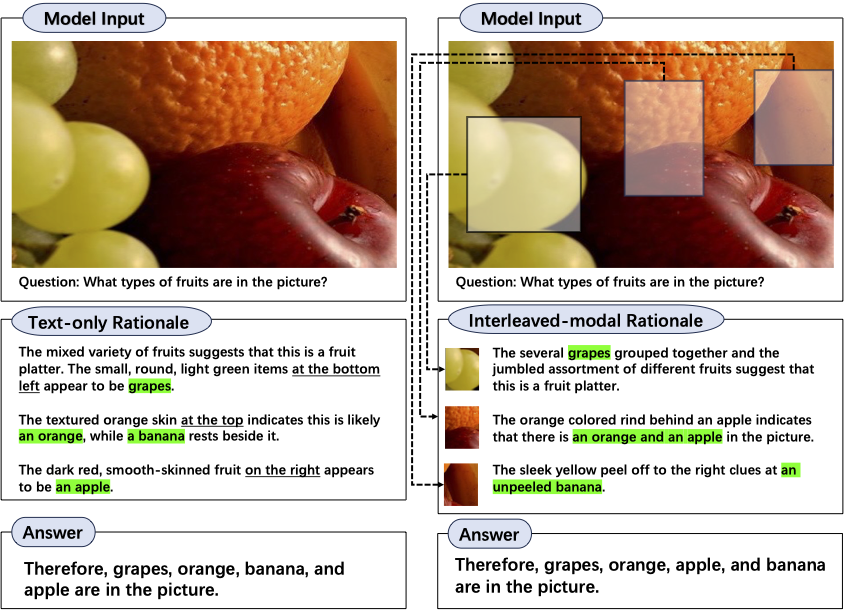
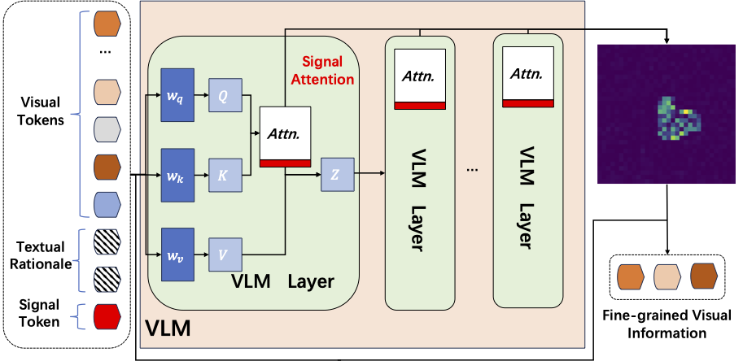

# [CVPR’25] Interleaved-Modal Chain-of-Thought

This repository contains the official implementation of **Interleaved-Modal Chain-of-Thought (ICoT)**, accepted at **CVPR 2025**.

---

## 🖥️ Introduction

Interleaved-modal Chain-of-Thought (ICoT) is a novel reasoning paradigm for VLMs that integrates both visual and textual information in a structured chain-of-thought. By interleaving visual and textual cues, ICoT enhances multi-modal reasoning and improves performance across benchmarks.

---

## 🚀 Features

- **Multi-Modal Chain-of-Thought:** Interleaves textual and visual steps for stronger multi-modal understanding.  
  

- **Generalizable Architecture:** Plug-and-play; applicable to different VLM backbones.  
  

---

## 📦 Installation

### 0) Prerequisites
- **Python 3.10** (required)
- **CUDA-enabled GPU** recommended (e.g., RTX 40-series)
- Linux/macOS shell

### 1) Clone

```bash
git clone https://github.com/jungao1106/ICoT.git
cd ICoT
```

### 2) Create & activate a virtual environment (Python 3.10)

```bash
python3.10 -m venv .venv
source .venv/bin/activate
```

### 3) Install dependencies

```bash
pip install --upgrade pip
pip install -r requirements.txt
```

---

## 🧩 Patch Transformers

We provide scripts to copy Chameleon files and patch `transformers/generation/utils.py`.

### 4) Make patch scripts executable

```bash
chmod +x ~/Desktop/ICoT/patch_ch.sh
```

### 5) Run patches

```bash
bash patch_ch.sh
```

These scripts will:
- Copy `processing_chameleon.py` and `modeling_chameleon.py` into  
  `transformers/models/chameleon/` in your environment.
- Patch `GenerationMixin._sample` in `transformers/generation/utils.py` with the conditional vokens update.

---

## 📂 Data Preparation

### 6) M³CoT Dataset

1. Download from Google Drive:  
   [M³CoT Dataset](https://drive.google.com/file/d/1v2ysvsKHJ8-ugnxwseaN28s6BZmHlpKN/edit)
2. Unzip and **rename** the folder to `m3cot`
3. Place inside the `data/` folder:
```
gdown --id 1v2ysvsKHJ8-ugnxwseaN28s6BZmHlpKN -O m3cot.zip && unzip m3cot.zip && mv "M³CoT Dataset" m3cot && mv m3cot data/
```

```
ICoT/
├─ data/
│  └─ m3cot/
│     ├─ train.jsonl
│     ├─ dev.jsonl
│     ├─ test.jsonl
│     └─ images/
│        ├─ physical-commonsense-1409.png
│        └─ ...
```

### (Optional) Other datasets

- [ScienceQA](http://scienceqa.github.io)  
- [LLaVA-W](https://huggingface.co/datasets/liuhaotian/llava-bench-in-the-wild)  

Download and place them in `data/`, then update paths in `run.py`.

---

## 🔥 Usage

### 7) Run inference/evaluation

```bash
bash run.sh
```

---

## 🛠️ Tips & Troubleshooting

- **Quantization**  
  Ensure `bitsandbytes` is installed if using 4-bit/8-bit.  
  ```bash
  pip install "bitsandbytes>=0.43.0"
  ```

- **Device mismatch warning**  
  If you see:  
  *“input_ids is on cpu, whereas the model is on cuda”*  
  add:  
  ```python
  input_ids = input_ids.to(model.device)
  ```

- **Missing files**  
  Errors like `Missing eval file: ./data/m3cot/test.jsonl` or  
  `Missing image: ./data/m3cot/images/xxx.png` mean the dataset isn’t correctly placed.  


---

## ✅ Quick Start 16 GB VRAM(Step-by-Step)

```bash
# 1) Clone & enter
git clone https://github.com/jungao1106/ICoT.git
cd ICoT

# 2) Virtual environment (Python 3.10)
python3.10 -m venv .venv
source .venv/bin/activate

# 3) Install dependencies
pip install --upgrade pip
pip install -r requirements.txt

# 4) Make patches executable
chmod +x patch_ch.sh

# 5) Run patches
bash patch_ch.sh

# 6) Data: download from Google Drive, rename to m3cot, place under ./data/m3cot/
gdown --id 1v2ysvsKHJ8-ugnxwseaN28s6BZmHlpKN -O m3cot.zip && unzip -q m3cot.zip -d data && rm -rf data/m3cot && mkdir -p data/m3cot && mv data/data/* data/m3cot/ && rm -rf data/data m3cot.zip

# 7) Run
bash run.sh
```
---

## 📜 Citation

If you find our work useful, please cite:

```bibtex
@article{gao2024interleaved,
  title={Interleaved-modal chain-of-thought},
  author={Gao, Jun and Li, Yongqi and Cao, Ziqiang and Li, Wenjie},
  journal={arXiv preprint arXiv:2411.19488},
  year={2024}
}
```
